# Deploy a flask app to OpenShift and connect to db2 using an OpenShift secret

Applications nowadays are built in many different source codes and in many components hence comes the concept of microservices 
where you build your application in different small pieces (containers) and use some orchestration tool hat can orchestrate 
your processes simply and ensure that all tasks happen in the proper order.

RedHat's Openshift has emerged as a leading hybrid cloud, enterprise Kubernetes application platform that can help with containerizing, deploying, and monitoring your application. It delivers a cloud-like experience as a self-managing
platform with automatic software updates and lifecycle management across hybrid cloud environments.

In today's tutorial, we will see how easy it is to deploy an app and connect it securely to a database elsewhere using Openshift
secret to ensure credentials are encrypted yet accessible to our application, Openshift will automatically detect our framework
containerize, deploy, and manage our application in a span of minutes.

# Prerequisites
In order to follow the tutorial you should have.

- Active IBM cloud account, please create one if you don't have one on [IBM Cloud](https://cloud.ibm.com/registration)
- provisioned OpenShift 4.2, you can provision yours [here](https://cloud.ibm.com/kubernetes/landing?platformType=openshift)
- OpenShift CLI, download [HERE](https://cloud.ibm.com/docs/openshift?topic=openshift-openshift-cli)

# Estimated Time
This tutorial should take about 45 min to complete.

# Steps

***1- create a db2 database on IBM cloud***

- Go to Catalog -> choose services from the left pane -> tick the database checkbox -> choose db2

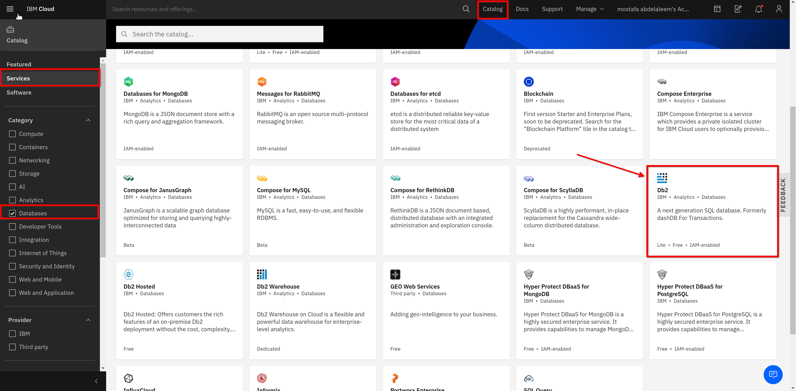


- Create a lite plan instance of db2 database, change the location and name if you wish then press create

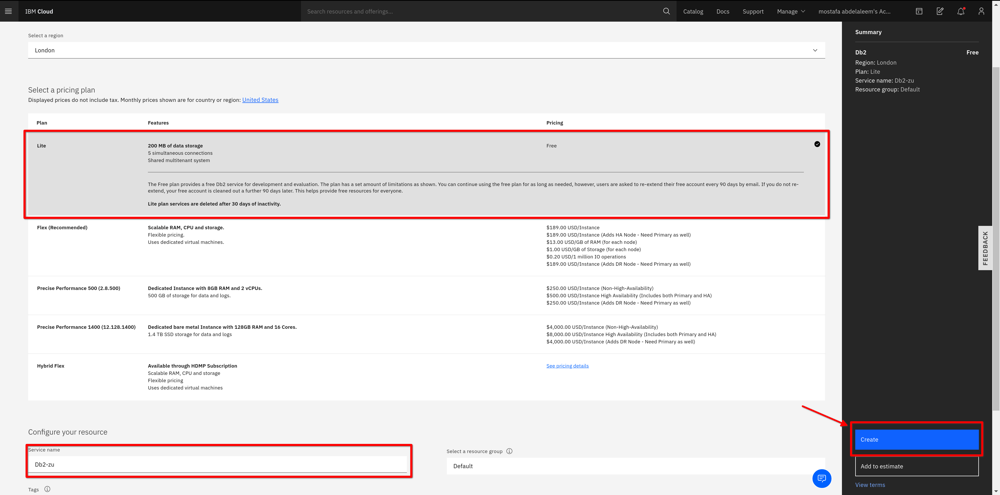


***2- create credentials for your db2 database***


- press service credentials then new credentials

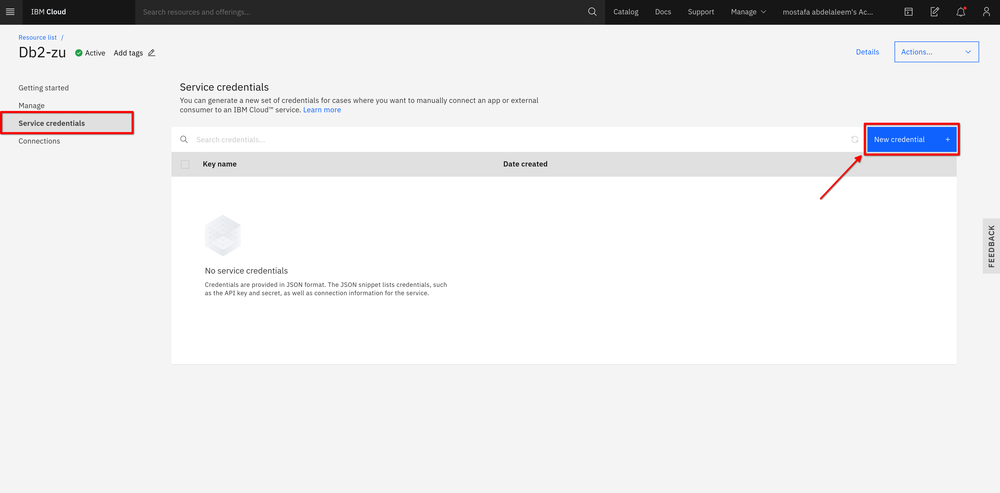


- expnand your created credentials and make note of the database URI

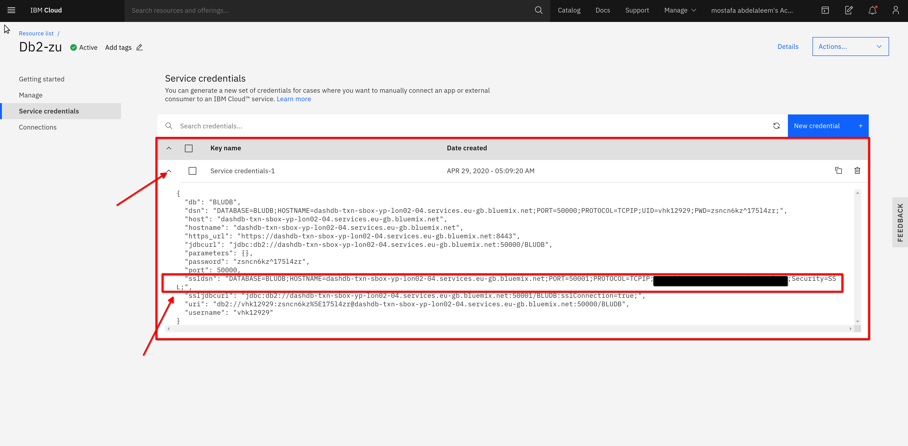


- [optional] open the console to track changes in the database

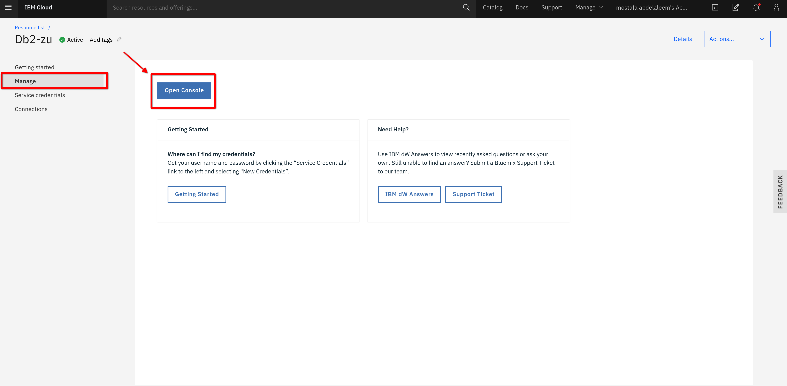

***3- create an OpenShift Project***

- from terminal
```
oc new-project flask-db-project
```

- Or from OC web-console switch to developer mode for a simpler view and create a project
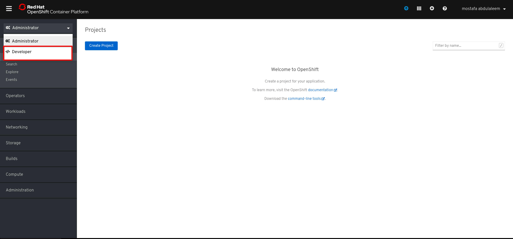
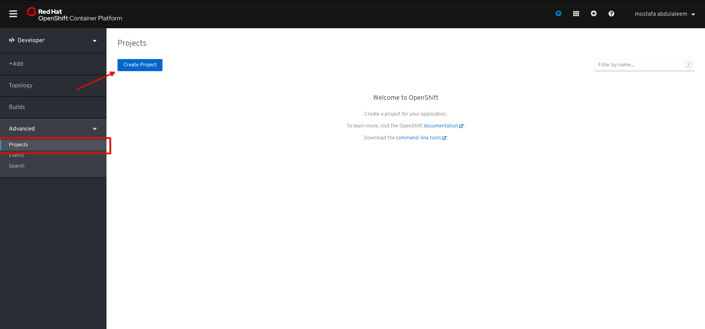

***4- create an OpenShift Secret***

- from terminal create a secret to store and encrypt our database credentials to access it later as an environment variable

**make sure the the secret name and key are `dbcred` as the application access the env variables by the key name**
```
oc create secret generic dbced --from-literal=dbcre="your db2 ssldsn value"
```
ex. oc create secret generic dbced --from-literal=dbcre="DATABASE=**;HOSTNAME=**;PORT=50001;PROTOCOL=TCPIP;UID=**;PWD=**;Security=SSL;"

-Or from OC webconsole go to search under advanced and filter services for secrets then create a key value secret
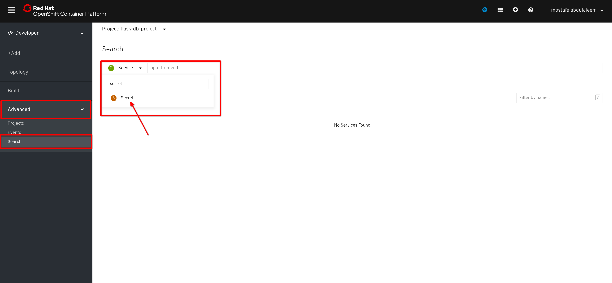
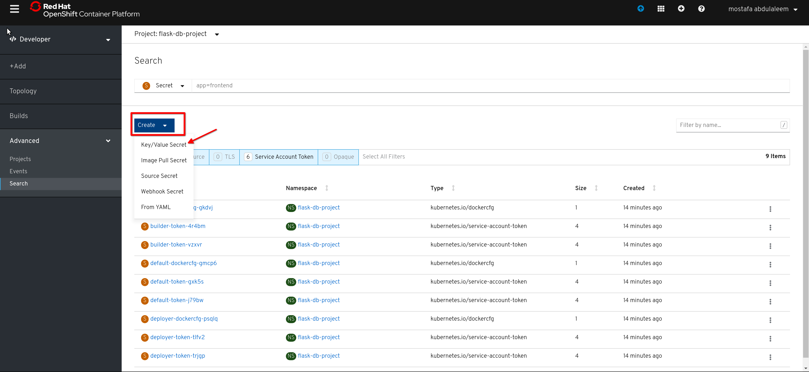
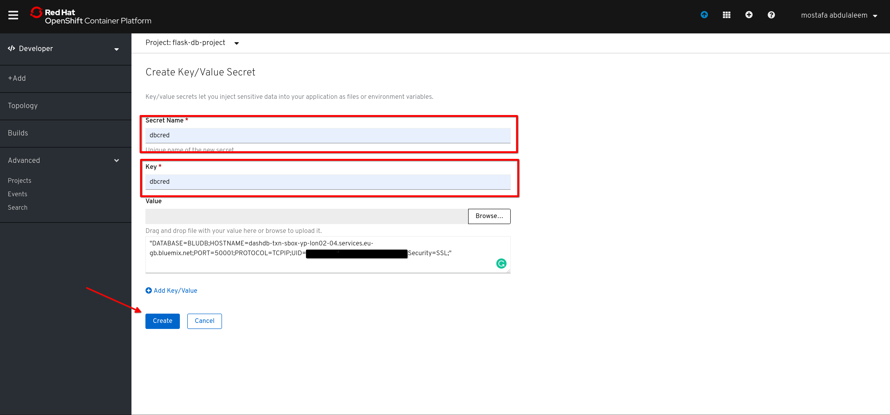

***5- deploy our flask app and connect it to th db database***

- create a new app by going to add, choose from catalog 

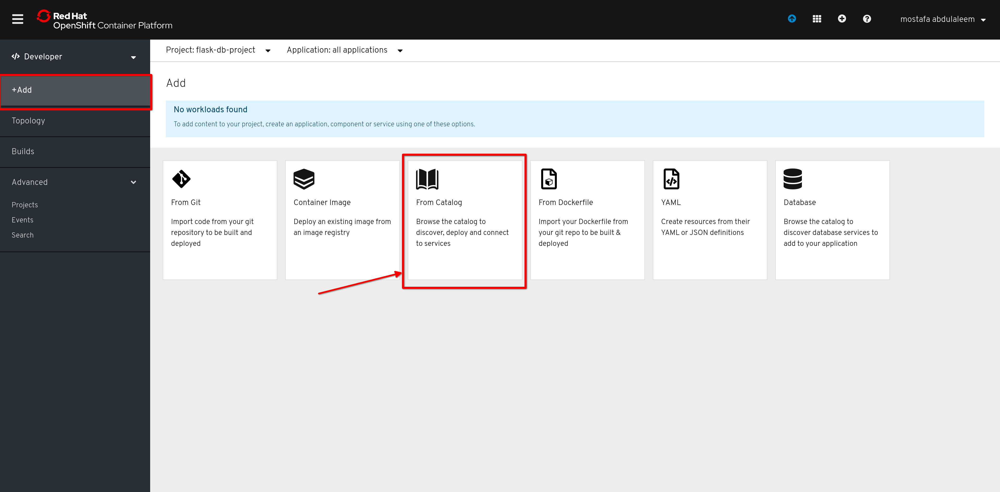

- Choose python in languages and choose a python app then press create application 

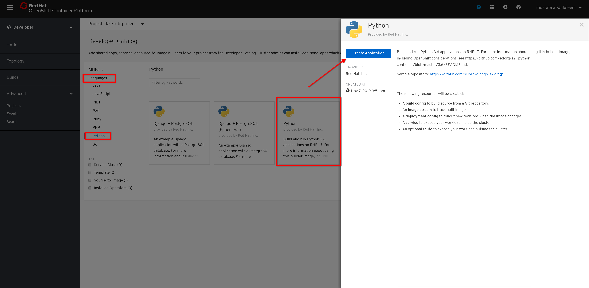

- Add the github Repo URL in  and show advanced option than add /flask-app in Context Dir field and choose a name for your app

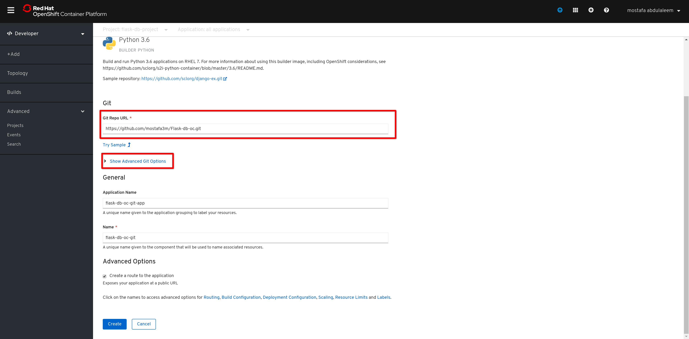
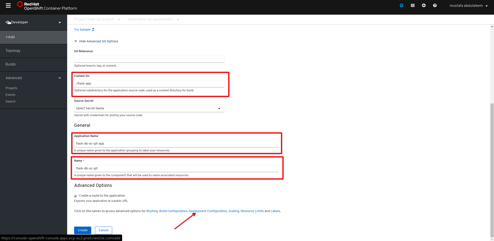


- press on Deployment Configuration and choose Add from config map or secret and add the values of our secret
- Remove the empty Environment Variable and click create

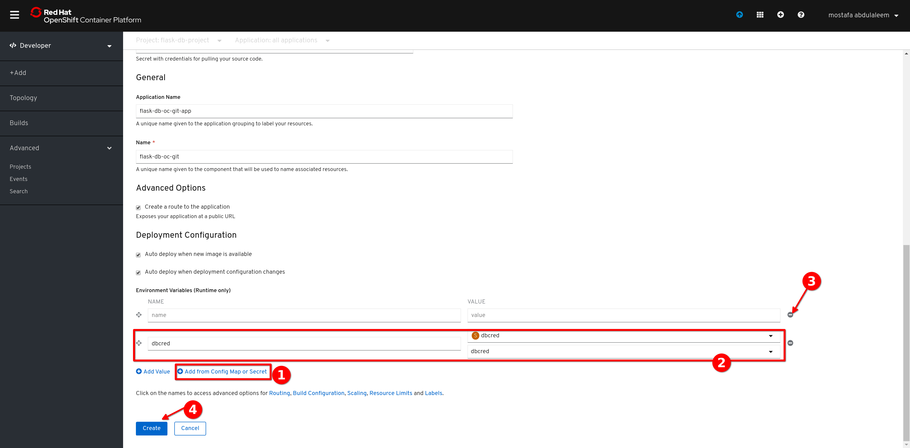


***6- monitor the build and deployment process***

- your can monitor the build process and the deployment process untill it's done.
- Also notice the app route (URL)

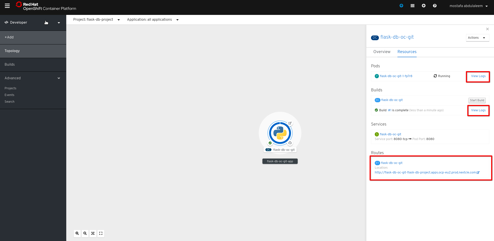


***7- Verify the app works and connents to db2 database***

Remember to open the db2 console to watch changes if you want. please note that db2 lite plan gives one schema where you
can create table and it has the same name as your user in the service credentials so watch changes there

**the app has four URLs**

- 1- main URL: (the APP exposed route)
  It shows that the App is online and also creates a table named values in the db2 database
  
  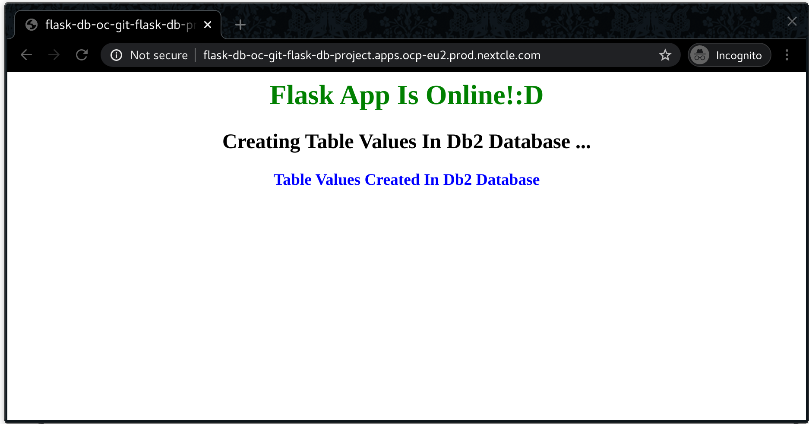


- 2- insert name URL: (the APP exposed route)/insertname  
  This URL inserts a name in the table we created on the db2 database
  
  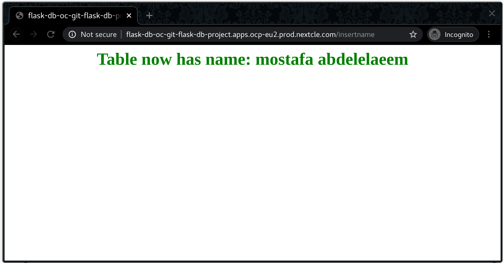

  
- 3- table content URl:(the APP exposed route)/db2  
   This URL shows the data in the values table
   
   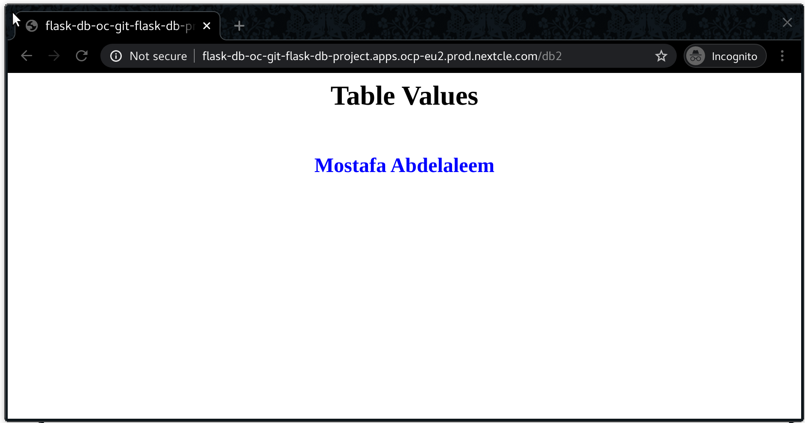


- 4- Delete table URl:(the APP exposed route)/deletetable  
   This URL deletes the values table from db2 database
   
   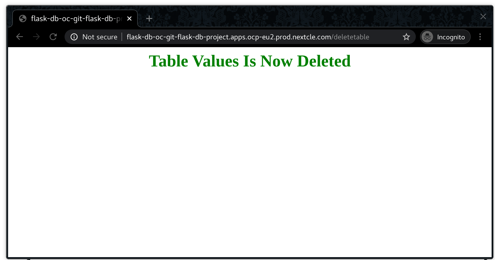


